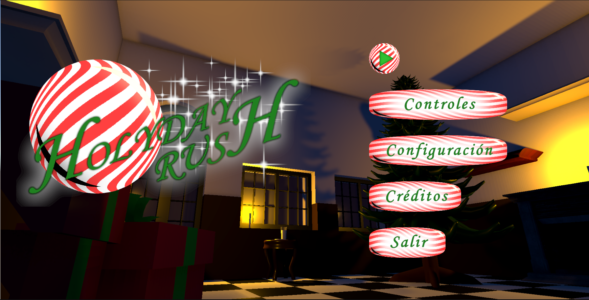
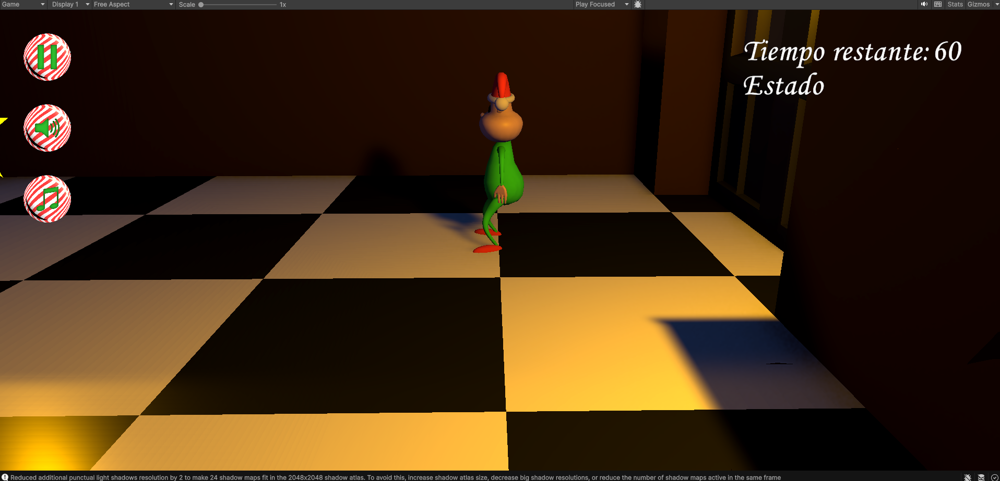
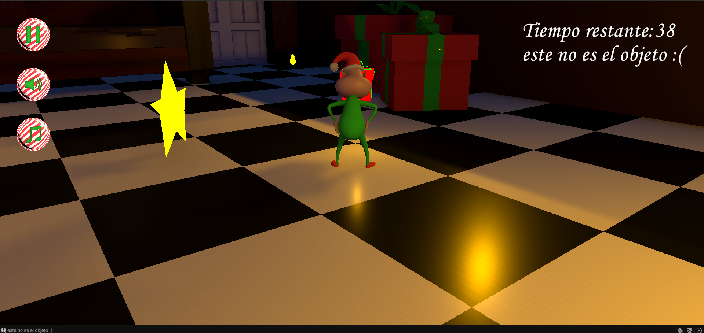
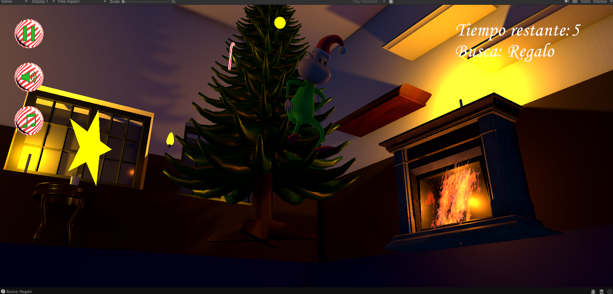
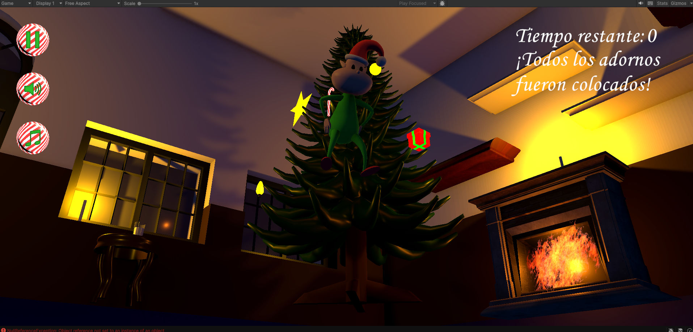

# 🎄 HOLIDAY RUSH

Juego 3D desarrollado durante una **Game Jam con temática navideña**, utilizando **Unity y C#**.

El jugador debe encontrar diferentes objetos repartidos por el escenario y llevarlos hasta el árbol de Navidad para decorarlo antes de que se acabe el tiempo.

El proyecto está enfocado en la interacción del jugador con objetos, cumplimiento de objetivos y gestión de un temporizador.

---

## 🎥 Gameplay

[▶️ Ver gameplay en YouTube](https://www.youtube.com/watch?v=_zuk4Rujmyg)

---

## 🛠️ Tecnologías

- Unity
- C#
- 3D
- Gameplay
- UI
- Git / GitHub

---

## ✨ Características

- Sistema de temporizador.
- Búsqueda de objetos.
- Interacción con objetos del escenario.
- Sistema de transporte de objetos.
- Decoración del árbol de Navidad.
- Objetivos que cambian durante la partida.
- Sistema de interacción con zonas específicas.
- Interfaz de usuario.
- Diseño de escenario 3D.

---

## 🎮 Mecánica principal

El jugador recibe un objeto que debe encontrar dentro del escenario.

Una vez localizado:

1. Se acerca al objeto.
2. Lo recoge.
3. Lo transporta hasta el árbol.
4. Coloca el objeto en el punto correspondiente.
5. Recibe un nuevo objetivo.
6. Debe completar los objetivos antes de que termine el tiempo.

---

## 📸 Capturas del proyecto

### Escenario

### Exploración

### Interacción

### Decoración

### Gameplay

---

## 🎯 Objetivo del proyecto

Este proyecto fue desarrollado durante una **Game Jam**, con el objetivo de crear una experiencia jugable en un tiempo limitado y poner en práctica conocimientos de programación y desarrollo de videojuegos.

Mi participación estuvo enfocada principalmente en la **programación y desarrollo de gameplay**, trabajando en los diferentes sistemas necesarios para que la experiencia fuera funcional.

---

## 💻 Programación y sistemas desarrollados

Durante el desarrollo trabajé en:

- Movimiento del jugador utilizando `CharacterController`.
- Sistema de interacción con objetos.
- Sistema para recoger y transportar objetos.
- Detección de objetos cercanos.
- Sistema de objetivos.
- Selección de objetos requeridos.
- Temporizador de partida.
- Colocación de objetos en el árbol.
- Gestión de los estados de los objetos.
- Interfaz de usuario.
- Flujo principal del juego.

---

## 📚 Aprendizajes

Este proyecto me permitió reforzar conocimientos sobre:

- Programación en C#.
- Desarrollo de gameplay en Unity.
- Manejo de objetos e interacciones.
- Organización de sistemas mediante scripts.
- Desarrollo bajo presión de tiempo.
- Trabajo colaborativo durante una Game Jam.
- Control de versiones con Git y GitHub.

---

## 👨‍💻 Autor

**Andrés Yesid Niño Galvis**

Game Developer en formación.

### Tecnologías principales

**Unity · C# · 3D · Gameplay · UI**

---

## 🌐 Portafolio

Puedes conocer más sobre mis proyectos en:

**https://andresnino12.github.io**
